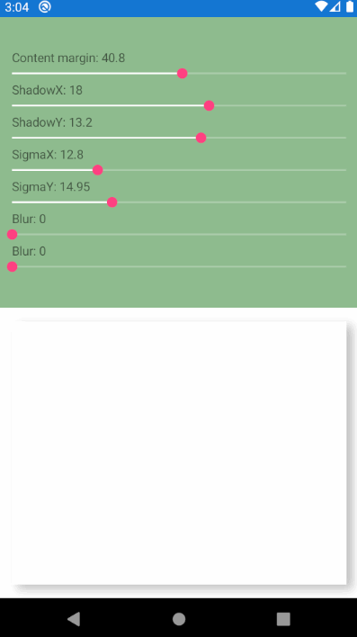

# Shadow experiment
Jugando con SkiaSharp para generar sombras [Referencia](https://forums.xamarin.com/discussion/117146/shadows-on-skiasharp-shape) [Gracias](https://forums.xamarin.com/profile/SYLENDRABABUJR)

Aveces necesitamos crear sombras para alguno de nuestro elementos en pantalla en Xamarin Forms y claro, lo de siempre, iOS funciona a las mil maravillas pero luego toca pelearse con Android y para los más nostálgicos como yo, aplicaciones de la tienda de Windows, UWP.

Es en esos momentos en los que SkiaSharp aparece para rescatarnos y ofrecernos una cantidad ingente de posibilidades y claro, cómo no, también podemos crear sombras.

Tienes un pequeño ejemplo de las opciones que ofrece SkiaSharp para generar y manipular sombras. Es cierto que las sombras están dentro del contenido del elemento, pero si le damos un poco de tiempo y jugamos con márgenes negativos, podemos hacer que las sombras afecten a elementos externos, pero eso ya te lo dejo a ti, para que juegues con la app y tengas un punto de entrada para personalizar aun más tus aplicaciones.

